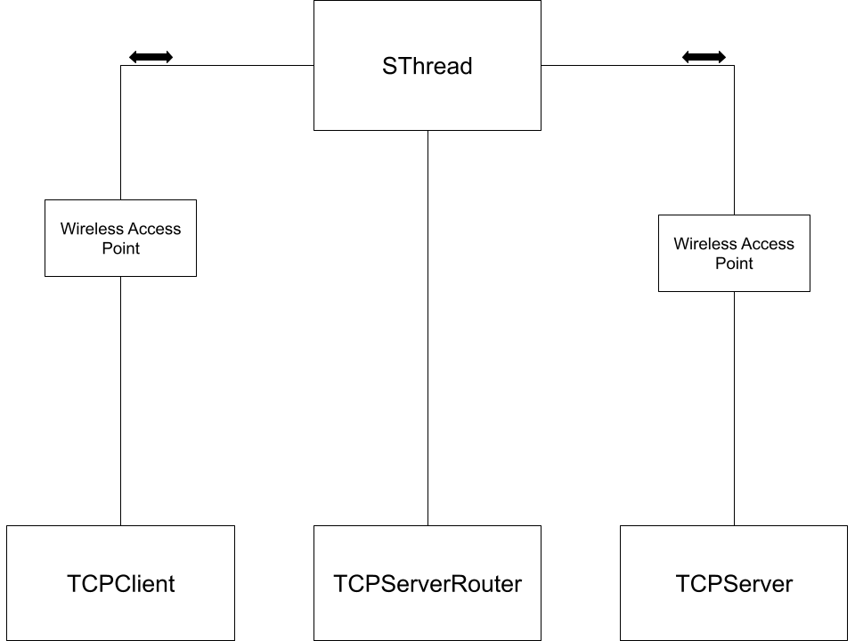
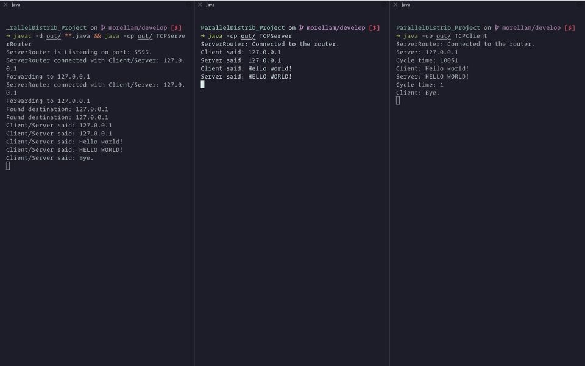

# User Guide for CS 4504 Project Part 1

Created by Mae B. Morella, Mionne Gooch, William McNab, Louis Todd, Ethan Blaizis, and Stephen Flenniken

## Functionality



This repository hosts three programs:

1. TCPServer
   - Receives messages from the client, and echoes them back in uppercase.
1. TCPClient
   - Reads a text file and transmits it to a socket.
1. TCPServerRouter
   - Establishes socketed connections between Server and Client instances.
   - Socket is closed when `"Bye.\n"` is received.

## Configuration

The client and server programs load configuration data from environmental variables:

- `ROUTER_HOSTNAME` – The hostname of the device running the ServerRouter instance.
- `DESTINATION_IP` – The IP address of the server/client instance for the program to connect to.

To make these values persistent, set them as system-wide variables (platform-dependent), or define them in a file named `.env`, as explained below.

## To deploy

1. Clone the project repository:

   ```sh
   git clone https://github.com/Mgooch2/ParallelDistrib_Project.git
   cd ParallelDistrib_Project
   ```

1. Compile the Java classes
   ```sh
   javac @classes
   ```
1. Create a file called .env containing the following definitions:

   ```sh
   # The hostname of the TCPServerRouter instance
   ROUTER_HOSTNAME=localhost
   # The IP address of the server/client to connect to
   DESTINATION_IP=127.0.0.1
   ```

   - For a connection between multiple machines, these should be changed to the desired values.

   - On Windows and POSIX systems, the `hostname` command will print the system's hostname.

   - On Windows, the `ipconfig` command will print this. On most Linux systems, `ip addr`, `hostname -I`, or `ifconfig` will print the system's IP address.

1. On one system, launch the TCPServerRouter program.

   ```sh
   java -cp src/ TCPServerRouter
   ```

1. On another system, launch the TCPServer

   ```sh
   java -cp src/ TCPServer
   ```

1. Finally, invoke the client process with the name of a text file

   ```sh
   java -cp src/ TCPClient txt/file.txt
   ```

## Output



## Copyright notice

The source code in this project is derived from files provided for the assignment by the Kennesaw State University College of Computing and Software Engineering. 

Copyright (c) 2021 Patrick O. Bobbie, and contributors.