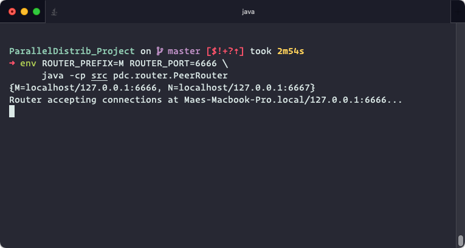
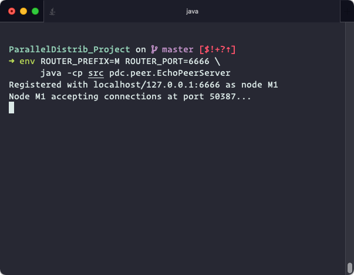
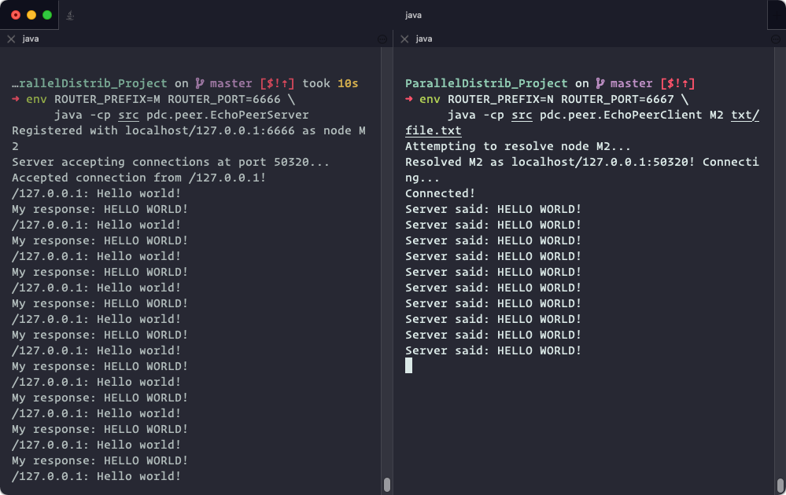

# User Guide for CS 4504 Project Part 2

by Mae B. Morella, Mionne Gooch, William McNab, Louis Todd, and Ethan Blaizis

## Programs

### PeerRouter

- The router `M` maintains a directory of "nodes", which are all addressed by an identifier like `M1`.
- Router `M` can resolve requests like `N1` by accessing the router `N`, if one exists.
- Accepts connections via a ServerSocket, and responds to the following commands:
  - `GET [node_id]` – resolves the IP address of the given node identifier and returns it.
  - `REGISTER [port]` – Registers the current client in the directory. Returns the unique identifier assigned.
  - `LIST` – returns a comma-separated list of registered node names, e.g `M1,M2,M3`
  - `LIST [router_prefix]` – connects to the given router name and invokes `LIST` there.

### EchoPeerServer

- One possible implementation of the abstract PeerServer class.
- Registers self with the specified router, and awaits connections.
- When a client connects and sends data, echo it back, converted to uppercase.

### EchoPeerClient

- One possible implementation of the abstract PeerClient class.
- Transmits a file line-by-line, and prints the server's response.
  - `java pdc.util.EchoPeerClient [node_id] [filename]`
  - `[node_id]` (e.g. `M1`) is the PeerServer instance to connect to
  - `[filename]` is the file to echo. To read stdin, use `-`.

## Configuration

These programs are configured based on environmental variables. These variables are loaded from the following sources, in order of priority.

1. A text file called `.env` in the PWD
2. Variables defined using `/usr/bin/env` or in the local shell environment
3. System variables

### PeerRouter program

- `ROUTER_PREFIX` – A character (ex. 'M') which identifies this router, and the nodes connected to it. If this is a letter, it must be uppercase. Nodes connected to the router M will have an identifier like `M1`.
- `ROUTER_PORT` – The port on which this router will run.
- `FRIEND_ROUTERS` (optional) – The other routers which this router can connect to in order to resolve node names. A comma-separated list of routers in the format `N:hostname:6667,O:hostname:6668`.

### PeerClient programs

- `ROUTER_HOSTNAME` – The hostname of the router to connect to
- `ROUTER_PORT` – The port of the router to connect to

## To deploy

1. Clone the project repository:

   ```sh
   git clone https://github.com/Mgooch2/ParallelDistrib_Project.git
   cd ParallelDistrib_Project
   ```

1. Compile the Java classes

   ```sh
   javac @classes
   ```

1. On one or more systems, set up a peer router...

   1. For each router instance, configure `.env` with a prefix and a port, like so:
      ```sh
      ROUTER_PREFIX=M
      ROUTER_PORT=6666
      ```
      ```sh
      ROUTER_PREFIX=N
      ROUTER_PORT=6667
      ```
      ```sh
      ROUTER_PREFIX=O
      ROUTER_PORT=6668
      ```
   1. Find the hostname of each router. On each router, set the `FRIEND_ROUTERS` value like so:
      ```sh
      FRIEND_ROUTERS=M:[hostname_m]:6666,N:[hostname_n]:6667,O:[hostname_o]:6668
      ```
   1. Invoke the PeerRouter program using the command:
      ```sh
      java -cp src pdc.router.PeerRouter
      ```
      

1. On another system, set up instance of EchoPeerServer...

   1. Configure `.env` to connect to one of the routers.
      ```sh
      ROUTER_HOSTNAME=[hostname_m]
      ROUTER_PORT=6666
      ```
   1. Invoke the EchoPeerServer program using the command:
      ```sh
      java -cp src pdc.router.EchoPeerServer
      ```
      This will launch a server instance on an arbitrary port.
   1. Make note of the unique ID (e.g. M1) which is assigned to this server instance.
      

1. On another system, set up instance of EchoPeerClient...
   1. Configure `.env` as in step 4.1
   1. Create some input file, e.g file.txt:
      ```txt
      Hello world!
      Hello world!
      Hello world! ...
      ```
   1. Invoke the EchoPeerClient program using the command, where `M1` is the server to connect to, and `file.txt` is the file to echo. To read stdin, use `-`.
      ```sh
      java -cp src pdc.router.EchoPeerServer M1 file.txt
      ```
      The client will access the router to resolve the server's IP address, open a connection, then send the text, which will be echoed back in uppercase.
      

## Copyright notice (for GitHub users)

Copyright (c) 2021 Mae B. Morella, Mionne Gooch, William McNab, Louis Todd, & Ethan Blaizis.

The software in this project at <http://github.com/Mgooch2/ParallelDistrib_Project> is provided for educational purposes, with NO WARRANTY. All rights reserved where applicable.
