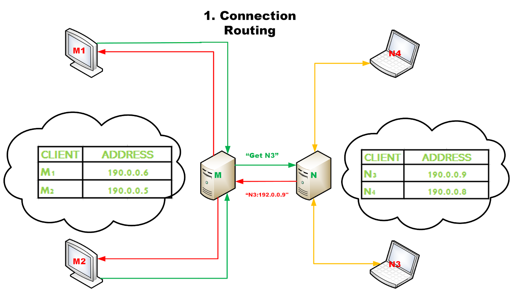

# User Guide for CS 4504 Project Part 2

Project by Mae B. Morella, Mionne Gooch, William McNab, Louis Todd, Ethan Blaizis, and Stephen Flenniken.

Document by Mae B. Morella.

## Functionality

TODO. Include the Vizio graphs.

## Configuration

These programs are configured based on environmental variables. These variables are loaded from the following sources, in order of priority.

1. A text file called `.env` in the PWD
2. Variables defined using `/usr/bin/env` or in the local shell environment
3. System variables

### PeerRouter program

- `ROUTER_PREFIX` – A character (ex. 'M') which identifies this router, and the nodes connected to it. If this is a letter, it must be uppercase. Nodes connected to the router M will have an identifier like `M1`.
- `ROUTER_PORT` – The port on which this router will run.
- `FRIEND_ROUTERS` (optional) – The other routers which this router can connect to in order to resolve node names. A comma-separated list of routers in the format `N:hostname:6667,O:hostname:6668`.

### PeerClient programs

- `ROUTER_HOSTNAME` – The hostname of the router to connect to
- `ROUTER_PORT` – The port of the router to connect to
- `MY_PORT` – The port on which this PeerClient will run

## To deploy

1. Clone the project repository:

   ```sh
   git clone https://github.com/Mgooch2/ParallelDistrib_Project.git
   cd ParallelDistrib_Project
   ```

1. Compile the Java classes
   ```sh
   javac @classes
   ```

TODO

## Output



## Copyright notice (for GitHub users)

Copyright (c) 2021 Mae B. Morella, Mionne Gooch, William McNab, Louis Todd, Ethan Blaizis, and Stephen Flenniken.

This public repository (<https://github.com/Mgooch2/ParallelDistrib_Project>) is provided for reference use only WITH NO WARRANTY. It is not licensed as free software. All rights reserved where applicable.

Using any portion of this project's documentation or implementation as part of an academic assignment may be considered plagiarism by the [KSU College of Computing and Software Engineering](https://ccse.kennesaw.edu/) or other institutions.
